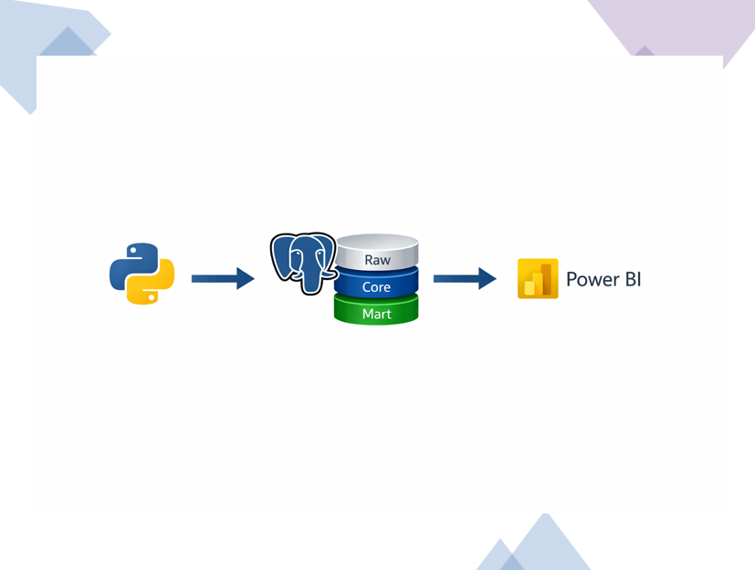
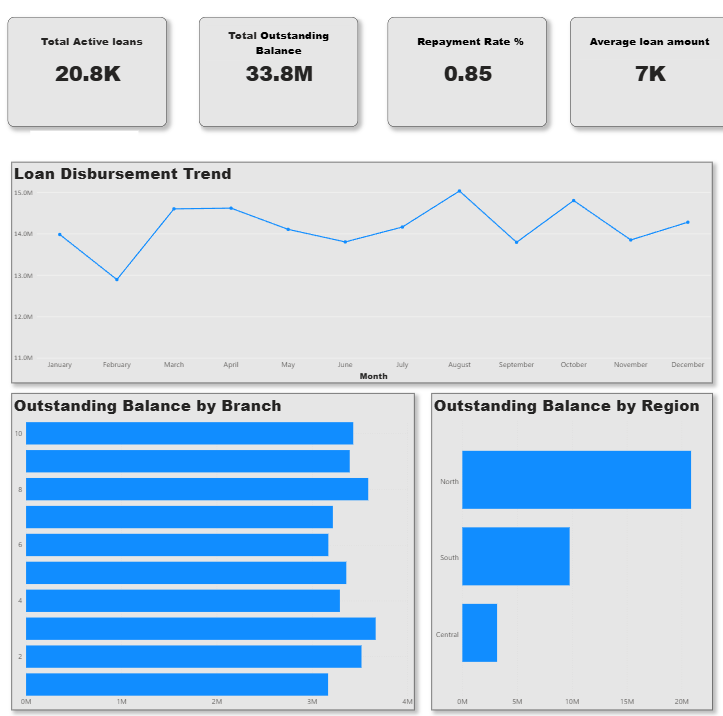
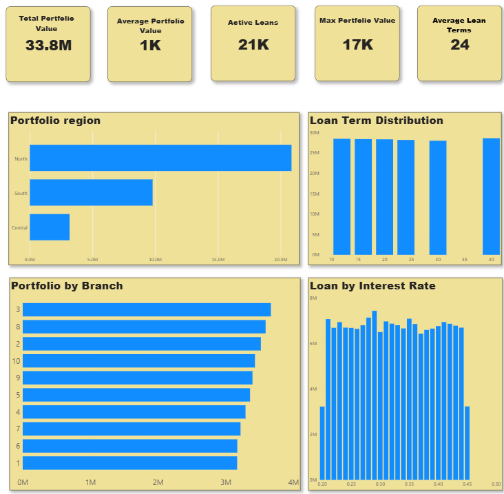
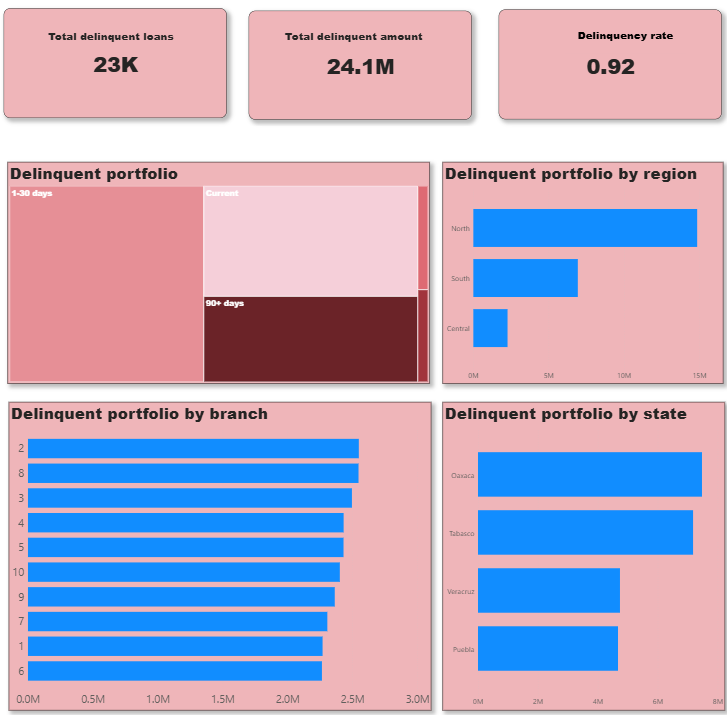

# Loan-Portfolio-Analytics
This project simulates an analytics platform used by lending or microfinance institutions to monitor loan portfolio performance and credit risk.

## Overview

The project demonstrates how transactional loan data can be transformed into analytical datasets and visualized through business intelligence dashboards.

The pipeline includes data generation, warehouse modeling, and dashboard development.

---

## Data Architecture

The data warehouse was implemented using PostgreSQL following a layered architecture similar to modern cloud data platforms.

### Raw Layer

Stores the raw generated data representing operational systems.

Examples of tables:

* loans
* repayments
* customers
* agents
* branches

### Core Layer

Structured warehouse model with fact and dimension tables.

Examples:

* fact_loan
* fact_repayment
* dim_customer
* dim_agent
* dim_branch
* dim_date

### Mart Layer

Business-ready analytical tables designed specifically for reporting and dashboards.

Examples:

* mart.executive_overview
* mart.portfolio_overview
* mart.delinquency

These tables simplify analytical queries and improve dashboard performance.

---

## Dashboards

Dashboards were built in Power BI to provide insights into the loan portfolio.

### Executive Overview

Provides a high-level summary of the loan characteristics.

---

### Portfolio Overview

Analyzes the structure of the loan portfolio including regional distribution and loan characteristics.

---

### Delinquency Overview

Focuses on credit risk monitoring through delinquency metrics and analysis.

---

## Technologies

* Python – synthetic data generation
* PostgreSQL – data warehouse implementation
* SQL – data transformations
* Power BI – dashboard development

---

## Skills Demonstrated

* Data warehouse design
* SQL data transformations
* Dimensional modeling
* Data mart creation
* Business intelligence dashboarding
* Financial analytics
